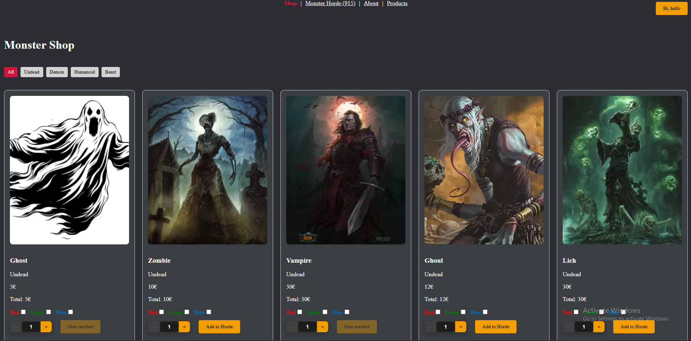
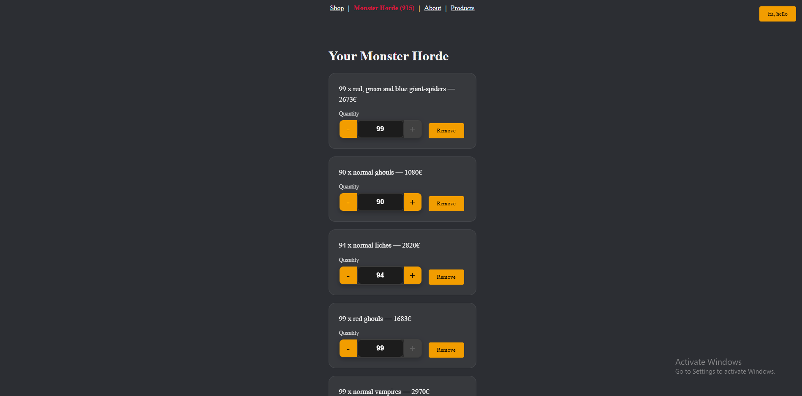
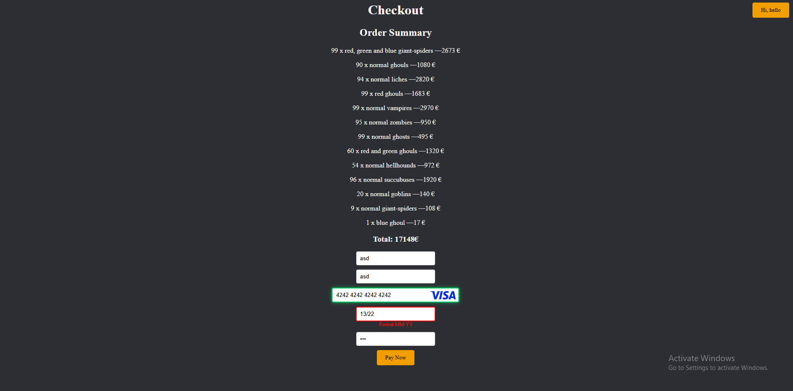
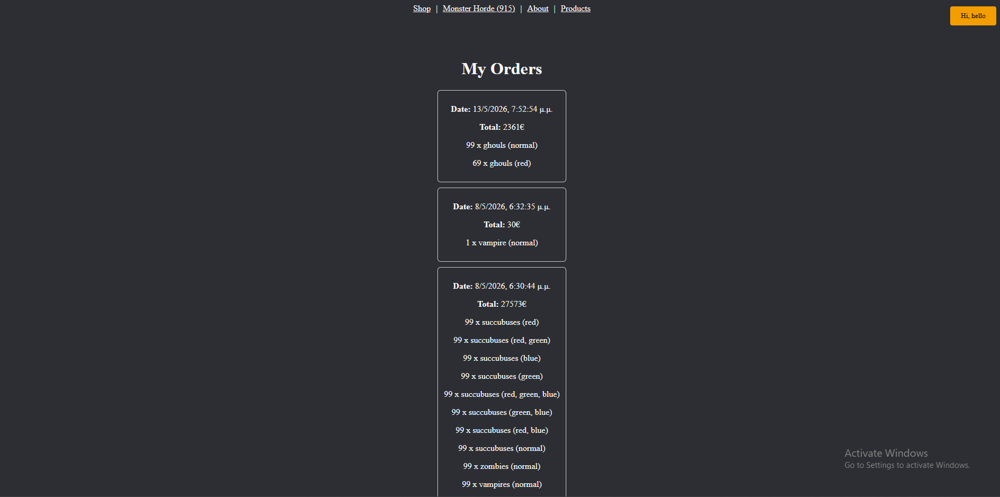

# Monster Horde Shop 

A React application where users can hire monsters in different colors,
manage their horde, and complete a mock checkout flow.

This project focuses on frontend logic, state management, and user experience.

---

## Features

- Hire monsters with customizable color options
- Quantity-based cart management (no duplicates)
- Persistent cart using LocalStorage
- Checkout flow with form validation
- Confirmation modals for destructive actions
- Toast notifications instead of browser alerts
- Dark mode support
- Sound effects (can be toggled)

---

## Screenshots

### Monster Shop

### Horde

### Checkout

### Order History

---

## Tech Stack

- React
- React Router
- Context API
- CSS Modules
- LocalStorage

---

## Project Notes

- This is a frontend-only project
- No real payments are processed
- Designed to demonstrate React state logic and UX patterns
